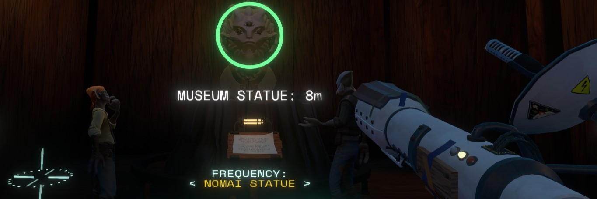

# More To Hear

Adds several new Signals and Frequencies to find and listen to acrosss the solar system!

Should provide a non-intrusive, lore-friendly experience. Does not alter or add any ship logs

# CHANGELOG (spoilers):

V1.1.0

Added a new signal (???) and frequency (???) to the FIG Backer Satellite

Added a new Signal (unknown) and frequency (unknown) to the Elsinore Bramble Seed (though, it cannot be identified)

V1.0.0

Added a new signal (LOOP_ERROR) and frequency (Anti-Graviton Flux) to the Advanced Warp Core, 

Added a new signal (Emission) to all White Hole cores (Anti-Graviton Flux), 

Added a new signal (Absorption) to all Black Hole cores (Anti-Graviton Flux), 

Added a new signal (Sun Station) to the Sun Station (Nomai Radio), 

Added new signals (Moon & Comet Shuttle) to the Nomai Shuttles (Nomai Radio), 

Added new signals (Museum, Island, & Probe Statue) and frequency (Nomai Statue) to the Activated Nomai Statues

V0.1.0

Added a new signal (Probe) and frequency (Nomai Radio) to the Nomai Probe 

# PLANNED UPDATES:

-Add signals to the Ash Twin masks on the Nomai Statues channel

-Add a signal to the vessel once its been reactivated

-Add a signal to the Eye of the Universe which can be heard from the Quantum Moon

-Add signals to Solanum and her corpses

-Add signals to the Stranger

-Gneiss banjo?

-Give more of the signals bespoke statistics for their traits, such as detection and identification radiuses

-Rework Graviton Flux channel (it feels really cluttered)

-...& more!
